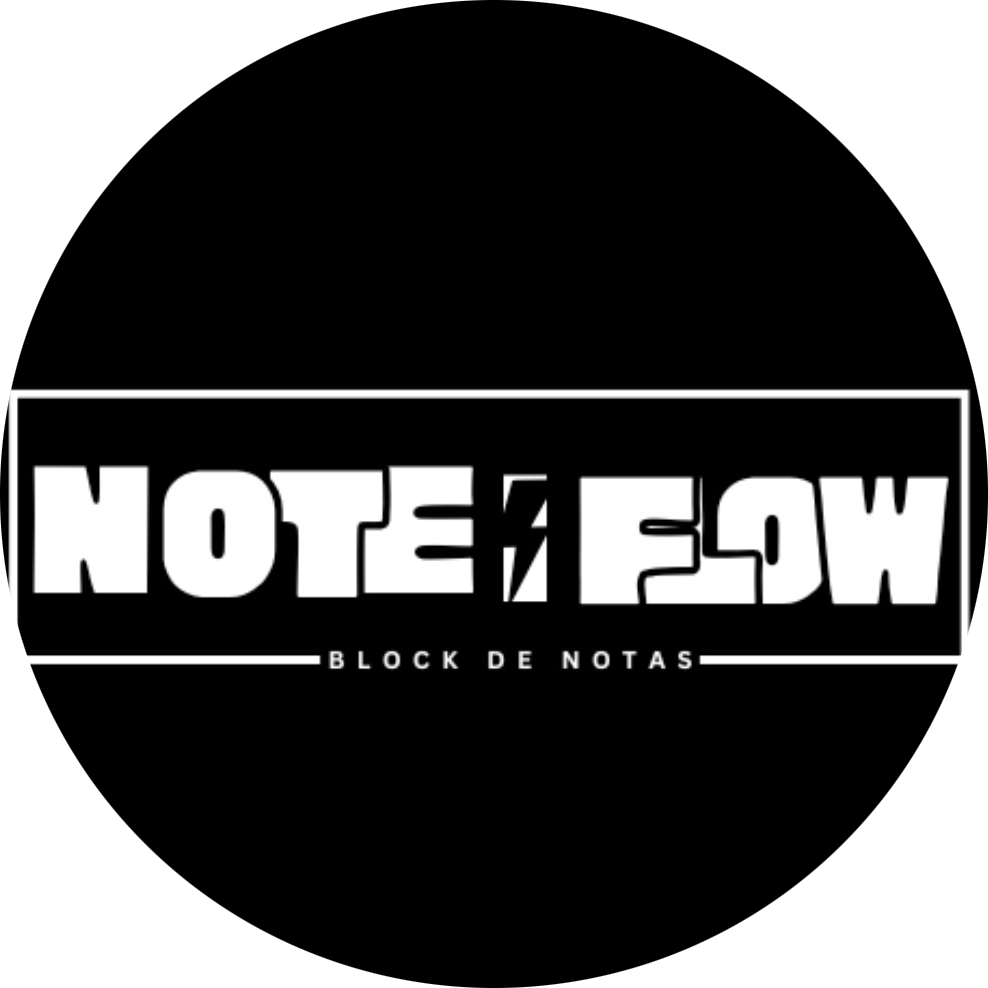

<div align="center">


&nbsp;&nbsp;&nbsp;&nbsp;

</div>

**Sistema web de gestión de notas personales — Proyecto SENA**

[](https://www.python.org/)
[](https://flask.palletsprojects.com/)
[](https://jinja.palletsprojects.com/)
[](https://www.postgresql.org/)
[](https://www.docker.com/)
[](https://developer.mozilla.org/es/docs/Web/JavaScript)
[](https://developer.mozilla.org/es/docs/Web/API/Fetch_API)
[](https://developer.mozilla.org/es/docs/Web/API/Web_Audio_API)
[](https://developers.google.com/identity)
[](https://developer.mozilla.org/es/docs/Web/HTML)
[](https://developer.mozilla.org/es/docs/Web/CSS)

</div>

---

## 📖 ¿Qué es NoteFlow?

NoteFlow es una aplicación web de gestión de notas personales que permite crear, organizar y personalizar notas en múltiples formatos: **texto, imágenes, audios, videos y dibujos**. Los usuarios pueden agruparlas en carpetas, asignarles etiquetas y elegir entre modo claro u oscuro según sus preferencias.

> Proyecto desarrollado como evidencia de aprendizaje del **Técnico en Programación de Software** en el SENA, integrando conocimientos de frontend, backend y base de datos bajo la metodología **SCRUM**.

---

## 👥 Equipo de desarrollo

| Nombre | Rol |
|--------|-----|
| Javier Steven Solís Ruiz | Desarrollador |
| Johan Sebastian Jojoa Meneses | Desarrollador |
| Juan Diego Monsalve Martínez | Desarrollador |
| Sergio Andrés Bustos Mondragón | Líder funcional |
| Juan Alejandro Tamayo Manzano | Documentador |

---

## 🧩 Características principales

- 🔐 **Autenticación** — Registro e inicio de sesión con validaciones de correo, alias y contraseña. Verificación por código al registrarse. Login con Google OAuth.
- 🌙 **Temas** — Modo claro / oscuro personalizable por usuario.
- 📝 **Notas multiformat** — Texto enriquecido, imágenes editables, audios con forma de onda, videos con reproductor, y dibujos en pizarra interactiva.
- 🗂️ **Organización** — Carpetas, etiquetas personalizadas y categorías.
- 🗑️ **Papelera** — Eliminación segura con restauración y vaciado automático a los 30 días.
- 🔍 **Búsqueda avanzada** — Por notas o carpetas, con filtros dinámicos.
- 🌐 **API REST** — Backend con Flask y comunicación vía Fetch API.
- 📄 **Documentación SCRUM** — Product Backlog, Sprints e Historias de Usuario.

---

## ⚙️ Tecnologías utilizadas

### 🖥️ Frontend

| Tecnología | Uso |
|------------|-----|
| HTML5 | Estructura semántica de todas las vistas |
| CSS3 | Sistema de diseño propio con variables y animaciones |
| JavaScript ES6+ | Lógica de cada editor, validaciones y eventos |
| Fetch API | Comunicación asíncrona con el backend (sin recargar página) |
| Web Audio API | Decodificación y visualización de forma de onda en el editor de audio |
| MediaRecorder API | Grabación de audio y video desde el micrófono/cámara del usuario |
| Canvas API | Editor de dibujo e imagen con trazos, filtros y transformaciones |

### ⚙️ Backend

| Tecnología | Uso |
|------------|-----|
| Python 3.10+ | Lenguaje principal del servidor |
| Flask 2.x | Framework web — rutas, sesiones y API REST |
| Jinja2 | Motor de plantillas HTML renderizadas desde el servidor |
| psycopg2 | Driver Python para conectar y operar con PostgreSQL |
| Flask-Mail | Envío de correos (verificación de cuenta, recuperación de contraseña) |
| Werkzeug | Hashing seguro de contraseñas y utilidades HTTP |
| python-dotenv | Carga de variables de entorno desde el archivo `.env` |

### 🔐 Autenticación

| Tecnología | Uso |
|------------|-----|
| Google OAuth 2.0 | Inicio de sesión con cuenta Google |
| google-auth-oauthlib | Manejo del flujo OAuth desde Flask |
| Códigos de verificación | Validación del correo al registrarse (6 dígitos, expira en 15 min) |
| Tokens de reset | Recuperación segura de contraseña con enlace de un solo uso |

### 🗄️ Base de datos e infraestructura

| Tecnología | Uso |
|------------|-----|
| PostgreSQL 15 | Motor de base de datos relacional |
| Docker | Contenedorización del backend y la base de datos |
| Docker Compose | Orquestación de todos los servicios con un solo comando |
| pgAdmin | Panel visual de administración de la base de datos |

### 🛠️ Herramientas y metodología

| Herramienta | Uso |
|------------|-----|
| Git / GitHub | Control de versiones y colaboración del equipo |
| Draw.io | Diagramas de casos de uso, flujo y base de datos |
| SCRUM | Metodología ágil — Backlog, Sprints, Historias de Usuario |
| Word | Documentación técnica y requerimientos |

---

## 🚀 Instalación y puesta en marcha

### Requisitos previos

- [Git](https://git-scm.com/)
- [Docker](https://www.docker.com/) y Docker Compose

### 1. Clonar el repositorio

```bash
git clone https://github.com/Sergio-Bustos/NoteFlow
cd NoteFlow
```

### 2. Obtener el archivo `.env`

El archivo `.env` contiene las credenciales de la base de datos y configuración del entorno. Solo los programadores oficiales del proyecto tienen acceso.

> 🔒 **Acceso restringido:** [Descargar `.env` desde Google Drive](https://drive.google.com/drive/folders/1j6oWPRPDeAs3kQf88-q5krcMAhVzE79K?usp=sharing)

Coloca el archivo `.env` en la raíz del proyecto una vez descargado.

### 3. Levantar los servicios con Docker

```bash
docker-compose up --build
```

Esto levantará automáticamente el backend (Flask), la base de datos (PostgreSQL) y el panel de administración (pgAdmin).

### 4. Acceder a la aplicación

| Servicio | URL |
|----------|-----|
| 🌐 Aplicación principal | `http://127.0.0.1:5000` |
| 🗄️ pgAdmin (gestión BD) | `http://localhost:5050` |

### 5. Acceso en red local

Para que otros dispositivos en tu red puedan acceder, obtén tu IP local:

```bash
# Windows
ipconfig

# Linux / macOS
ip addr
```

Luego accede desde cualquier dispositivo con:

```
http://<tu-ip-local>:5000
# Ejemplo: http://192.168.1.100:5000
```

### 6. Verificar la base de datos

Asegúrate de que PostgreSQL esté corriendo y de que el puerto `5432` esté expuesto correctamente en Docker. Puedes verificar el estado del contenedor con:

```bash
docker ps
docker logs "nombre-contenedor-db"
```

---

## 📁 Estructura del proyecto

```
NoteFlow/
├── app.py                  # Aplicación principal Flask
├── docker-compose.yml      # Configuración de servicios Docker
├── .env                    # Variables de entorno (no incluido en el repo)
├── static/
│   ├── css/                # Hojas de estilo
│   ├── js/                 # Lógica de cada editor (audio, video, imagen, etc.)
│   └── uploads/            # Archivos subidos por los usuarios
├── templates/              # Plantillas HTML (Jinja2)
│   ├── dashboard.html
│   ├── notas.html
│   ├── editoraudio.html
│   ├── editorvideo.html
│   ├── editorimagen.html
│   ├── editortexto.html
│   └── dibujo.html
└── requirements.txt        # Dependencias Python
```

---

## 📜 Licencia

Proyecto académico desarrollado en el **SENA — Servicio Nacional de Aprendizaje**.  
Uso educativo. Todos los derechos reservados por el equipo de desarrollo.

---
<div align="center">
  <span style="font-weight: 900; font-size: 1.1em;">"NoteFlow... la solución de tu desorden digital, próximamente en la web..."</span>
  <br>
  Hecho con 💜 por el equipo NoteFlow · SENA 2025
</div>

